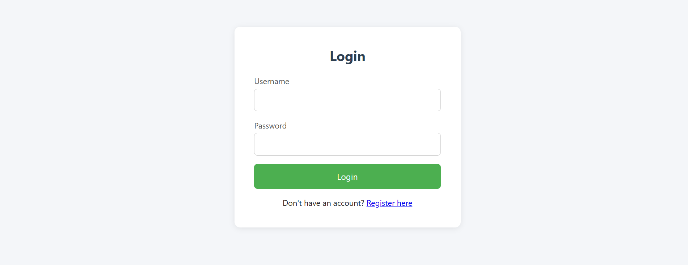
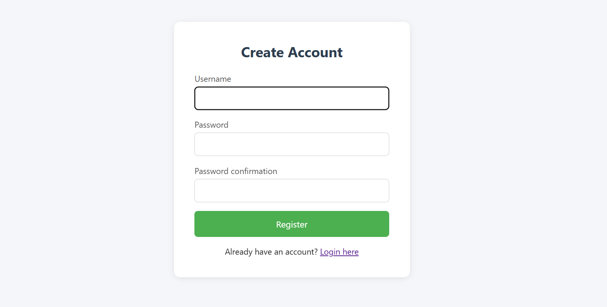
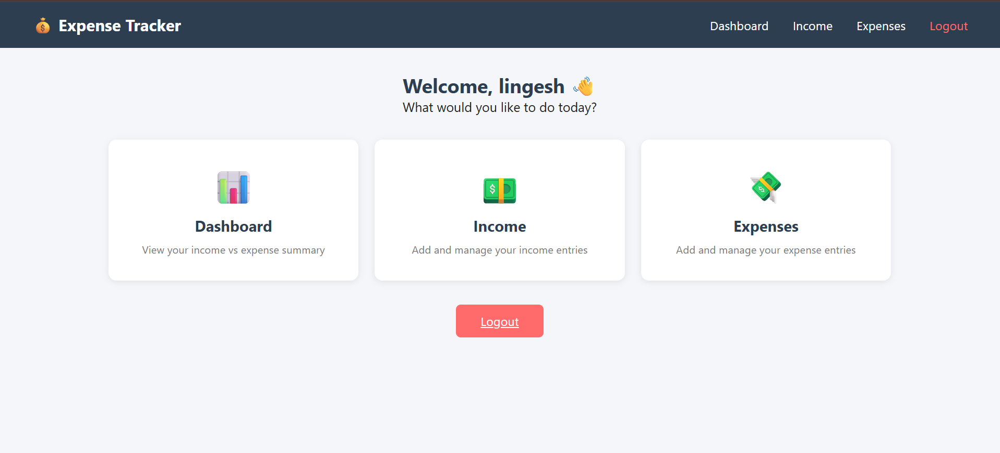
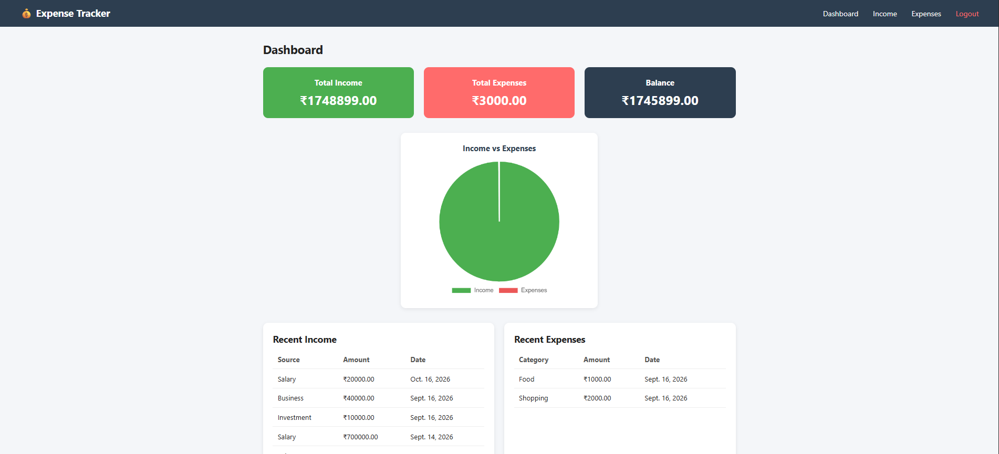
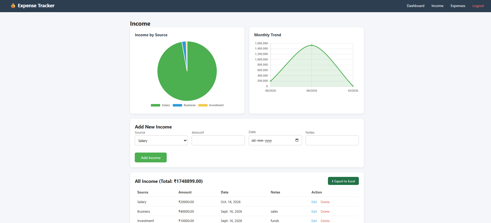
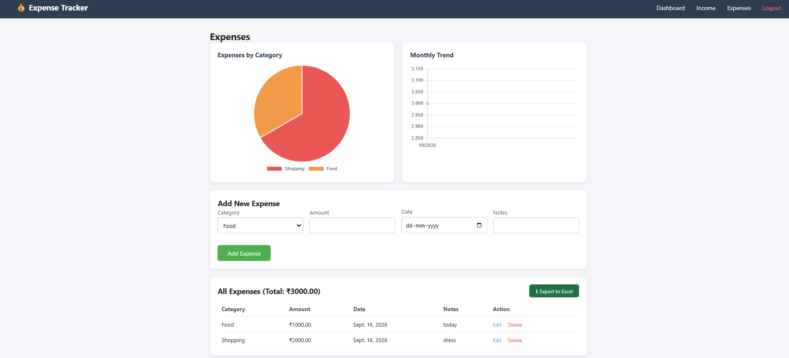

<<<<<<< HEAD
<p align="center">
  
</p>

<h1 align="center">💰 Expense Tracker</h1>

<p align="center">
  A simple personal finance web app to track income and expenses with visual charts.
</p>

---

## 🔗 Live Demo


(https://guruchidamabaram.pythonanywhere.com/)

---

## ✨ Features

- User Registration & Login
- Dashboard with Income vs Expenses pie chart
- Add / Edit / Delete Income entries
- Add / Edit / Delete Expense entries
- Charts — by category/source & monthly trend
- Export Income & Expenses as Excel report
- Secure, user-specific data (each login sees only their own records)

---

## 🚀 Future Enhancements

- Date-range filters (this month / last month / custom)
- Budget limit alerts per category
- Password reset via email
- Export as PDF
- Deploy with cloud MySQL (Railway / PlanetScale)

---

## 🛠 Tech Stack

| Layer | Technology |
|---|---|
| Frontend | HTML, CSS |
| Backend | Python (Django) |
| Database | MySQL |
| Charts | Chart.js |
| Excel Export | openpyxl |

---

## 📸 Screenshots

| Login | Register |
|---|---|
|  |  |

| Main Page | Dashboard |
|---|---|
|  |  |

| Income | Expenses |
|---|---|
|  |  |

## ⚙️ Installation (Local Development)

```bash
# 1. Clone the repository
git clone https://github.com/A-guru2004/Expense-Tracker
cd expense_tracker

# 2. Create a virtual environment
python -m venv venv
venv\Scripts\activate        # Windows
source venv/bin/activate     # Mac/Linux

# 3. Install dependencies
pip install -r requirements.txt

# 4. Create MySQL database
# open MySQL and run:
CREATE DATABASE expense_tracker_db;

# 5. Update DB credentials in expense_tracker/settings.py
#    (USER, PASSWORD)

# 6. Run migrations
python manage.py makemigrations
python manage.py migrate

# 7. Run the server
python manage.py runserver
```

Visit **http://127.0.0.1:8000/**
=======
# Expense-Tracker
>>>>>>> 8b598746b545eb9de582d3bbc6364c4c186cd22c
